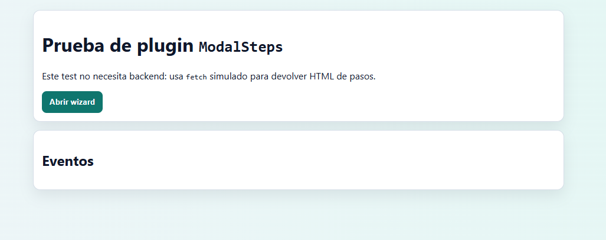
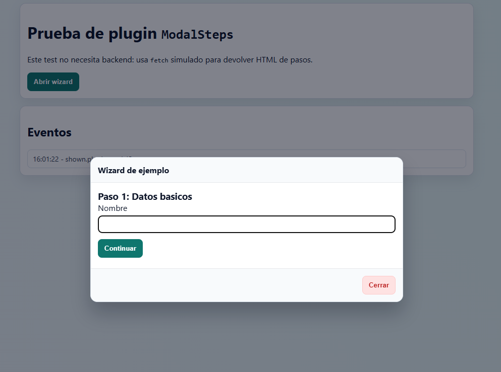
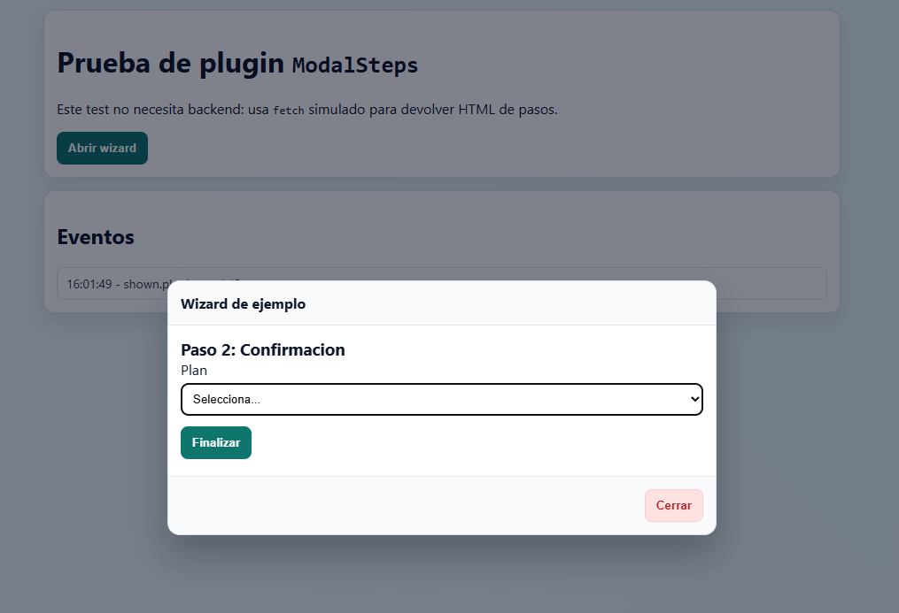
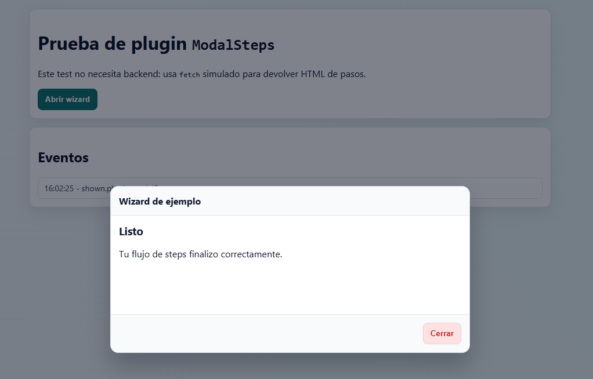

# ModalSteps

Plugin JavaScript nativo para manejar modales por pasos con carga remota de HTML y submit progresivo usando `fetch`.

## Requisitos

- Un navegador moderno con soporte para `fetch`, `MutationObserver`, `WeakMap`, `FormData` y `CustomEvent`.
- Un modal con `data-dialog="steps"` y contenedor interno `data-dialog="main"`.
- Un trigger que abra el modal y opcionalmente aporte `data-dialog-src`.

## Instalacion

Incluye el plugin:

```html
<script src="./modalSteps.min.js"></script>
```

Para produccion, usa `modalSteps.min.js`. Si necesitas depurar, puedes usar `modalSteps.js`.

## Uso Basico

```html
<button type="button" data-dialog-src="/steps/start" id="btnOpenWizard">
  Abrir wizard
</button>

<div id="stepsModal" role="dialog" data-dialog="steps" aria-hidden="true">
  <section data-dialog="main"></section>
</div>
```

El plugin se auto-inicializa sobre modales que cumplan:

- `[role="dialog"][data-dialog="steps"]`
- `dialog[data-dialog="steps"]`

## Como Funciona

- Escucha `shown.plugin.modalStep` para cargar el primer HTML del flujo.
- Inserta el contenido del paso en `data-dialog="main"`.
- Intercepta el `submit` de formularios dentro del modal.
- Los steps pueden trabajar con formularios `POST` para envio de datos y con solicitudes `GET` para consultar informacion de APIs.
- Envia datos con `fetch` y procesa respuestas por estado (`200`, `201`, `204`, `400`, `418`).
- Limpia el contenido en `hidden.plugin.modalStep`.

## Atributos `data-*` soportados

- `data-dialog="steps"`: marca el modal como sujeto del plugin. Estado: **requerido en auto-inicializacion**.
- `data-dialog="main"`: contenedor donde se renderiza cada step. Estado: **requerido**.
- `data-dialog-src`: URL del primer step en el trigger que abre el modal. Estado: **opcional/condicional** (si no se usa, puedes proveer `getFirstStepRequest` por API).
- `data-dialog-reload-on-no-content="true|false"`: controla recarga automatica en `201/204` sin contenido. Estado: **opcional**.

## API publica

```html
<script>
  const modal = document.querySelector('#stepsModal');

  const instance = window.ModalSteps.init(modal, {
    reloadOnNoContent: true,
    jsonResponseHandler: function (data, status, subject) {
      console.log('JSON', status, data, subject);
    },
    after201: function (content, response, subject) {
      console.log('after201', content, response, subject);
    },
    after204: function (response, subject) {
      console.log('after204', response, subject);
    }
  });

  instance.bind(function getFirstStepRequest() {
    return fetch('/steps/start', { credentials: 'same-origin' });
  });

  // Carga manual de contenido en el contenedor de pasos.
  instance.load('<form action="/steps/submit"><button type="submit">Enviar</button></form>');

  window.ModalSteps.getInstance(modal);
  window.ModalSteps.destroy(modal);
  window.ModalSteps.initAll(document);
  window.ModalSteps.destroyAll(document);
</script>
```

## Eventos del plugin

- `shown.plugin.modalStep`: evento esperado para disparar carga del primer step.
- `hidden.plugin.modalStep`: evento esperado para limpiar contenido del flujo.

## Opciones de seguridad

- `strictSameOrigin` (default: `true`): bloquea URLs de otros origenes para carga de steps y submit.
- `allowedSubmitMethods` (default: `['GET', 'POST']`): limita los metodos HTTP permitidos en el submit.

Notas:

- Si el formulario es `GET`, el plugin serializa campos a query string (sin body).
- Si el formulario es `POST`, el plugin envia `FormData` en el body.
- Solo se permiten URLs `http`/`https`.

## Errores comunes

- Falta `data-dialog="main"`: no hay contenedor para renderizar steps.
- El trigger no tiene `data-dialog-src` y no se define `getFirstStepRequest`: no se carga contenido.
- Respuesta HTTP inesperada: el plugin intenta cerrar el modal como fallback.

## Demo

Puedes abrir el archivo de prueba incluido en este proyecto:

- `test-modal-steps.html`

## Vista previa del ejemplo

Estado inicial del HTML:



Primer popup del flujo:



Segundo paso del flujo:



Ultimo modal del flujo:


